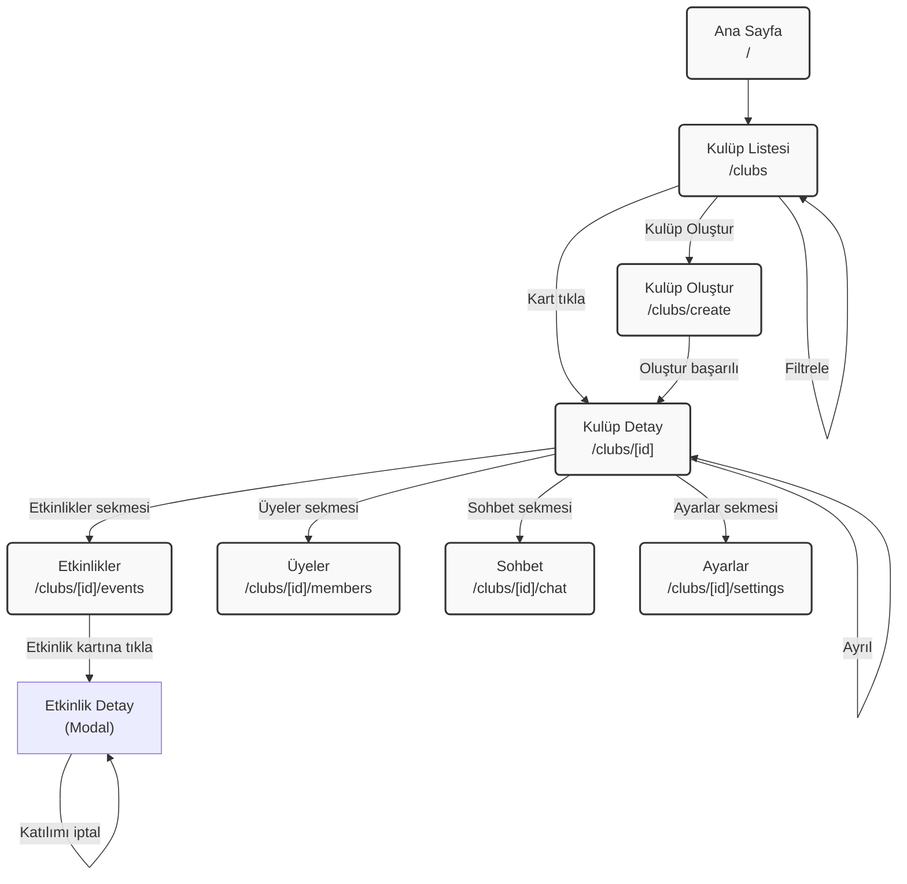

# Cluber Web - Wireframe Tasarımları

> Bu doküman, Cluber Web projesi için temel ekran wireframe'lerini içermektedir.
> Wireframe'ler basitlik ilkesiyle oluşturulmuştur; renk, yazı tipi ve estetik detaylar dahil edilmemiştir.

---

## 1. Ana Ekran / Arama Sayfası (Liste Ekranı)

**Amaç:** Kullanıcının kulüpleri listelediği ve arama/filtreleme yaptığı yer.

**URL:** `/clubs`

### Bileşenler

```
┌─────────────────────────────────────────────────────────────────┐
│                         HEADER                                  │
│  [Logo]                              [Profil İkonu] [Çıkış]    │
├─────────────────────────────────────────────────────────────────┤
│                                                                 │
│                     KEŞFET BAŞLIĞI                              │
│                                                                 │
│         "Sana Uygun Bir Kulüp Bul"                              │
│                                                                 │
│   İlgi alanlarına göre kulüplere katıl, yeni insanlar         │
│   tanı ve birlikte etkinlikler düzenle.                       │
│                                                                 │
│              [ + Kulüp Oluştur ]                                │
│                                                                 │
├─────────────────────────────────────────────────────────────────┤
│                                                                 │
│    ┌─────────────────────────────────────────────────────┐    │
│    │  🔍  Kulüp ara...                                   │    │
│    └─────────────────────────────────────────────────────┘    │
│                                                                 │
│   [Tümü] [Teknoloji] [Spor] [Müzik] [Sanat] [Bilim] ...       │
│                                                                 │
├─────────────────────────────────────────────────────────────────┤
│                                                                 │
│   ┌─────────────┐  ┌─────────────┐  ┌─────────────┐          │
│   │  [Banner]   │  │  [Banner]   │  │  [Banner]   │          │
│   │  ┌─────┐    │  │  ┌─────┐    │  │  ┌─────┐    │          │
│   │  │Avatar│    │  │  │Avatar│    │  │  │Avatar│    │          │
│   │  └─────┘    │  │  └─────┘    │  │  └─────┘    │          │
│   │             │  │             │  │             │          │
│   │  Kulüp Adı  │  │  Kulüp Adı  │  │  Kulüp Adı  │          │
│   │  [Kategori] │  │  [Kategori] │  │  [Kategori] │          │
│   │             │  │             │  │             │          │
│   │  👥 125     │  │  👥 89      │  │  👥 234     │          │
│   └─────────────┘  └─────────────┘  └─────────────┘          │
│                                                                 │
│   (Kulüp kartları网格 görünümü - her kart tıklanabilir)        │
│                                                                 │
└─────────────────────────────────────────────────────────────────┘
```

### Temel Bileşen Detayları

| Bileşen | Tip | Açıklama |
|---------|-----|----------|
| Arama Kutusu | Input | "Kulüp ara..." placeholder, debounce 500ms |
| Kategori Filtreleri | Button Group | Tümü, Teknoloji, Spor, Müzik, Sanat, Bilim, İş & Kariyer, Oyun, Edebiyat, Sinema, Diğer |
| Kulüp Kartı | Card | Banner görseli, avatar, kulüp adı, kategori, üye sayısı |
| Kulüp Oluştur Butonu | Button | Sadece giriş yapmış kullanıcılara gösterilir |

---

## 2. Kulüp Oluşturma Ekranı (Veri Ekleme Ekranı)

**Amaç:** Yeni kulüp oluşturmak için gerekli bilgileri almak.

**URL:** `/clubs/create`

### Bileşenler

```
┌─────────────────────────────────────────────────────────────────┐
│                                                                 │
│    ← Geri Dön                                                   │
│                                                                 │
├─────────────────────────────────────────────────────────────────┤
│                                                                 │
│         [✨] Yeni Bir Başlangıç                                 │
│                                                                 │
│              Topluluğunu Kur                                    │
│                                                                 │
├─────────────────────────────────────────────────────────────────┤
│                                                                 │
│   Kulüp Adı *                                                   │
│   ┌─────────────────────────────────────────────────────┐      │
│   │ Kulüp adını giriniz...                              │      │
│   └─────────────────────────────────────────────────────┘      │
│   (En az 3, en fazla 50 karakter)                             │
│                                                                 │
├─────────────────────────────────────────────────────────────────┤
│                                                                 │
│   İlgi Alanı *                                                  │
│   ┌─────────────────────────────────────────────────────┐      │
│   │ Teknoloji                                      ▼    │      │
│   └─────────────────────────────────────────────────────┘      │
│   (Teknoloji, Spor, Müzik, Sanat, Oyun, Eğitim, Diğer)        │
│                                                                 │
├─────────────────────────────────────────────────────────────────┤
│                                                                 │
│   Açıklama *                                                    │
│   ┌─────────────────────────────────────────────────────┐      │
│   │ Bu kulüp hakkında bilgi veriniz...                  │      │
│   │                                                     │      │
│   │                                                     │      │
│   └─────────────────────────────────────────────────────┘      │
│   (En az 10, en fazla 500 karakter)                          │
│                                                                 │
├─────────────────────────────────────────────────────────────────┤
│                                                                 │
│   Avatar URL (Opsiyonel)                                        │
│   ┌─────────────────────────────────────────────────────┐      │
│   │ https://...                                         │      │
│   └─────────────────────────────────────────────────────┘      │
│                                                                 │
├─────────────────────────────────────────────────────────────────┤
│                                                                 │
│   Banner URL (Opsiyonel)                                        │
│   ┌─────────────────────────────────────────────────────┐      │
│   │ https://...                                         │      │
│   └─────────────────────────────────────────────────────┘      │
│                                                                 │
├─────────────────────────────────────────────────────────────────┤
│                                                                 │
│              [ Kulübü Oluştur ]                                 │
│                                                                 │
└─────────────────────────────────────────────────────────────────┘
```

### Form Validasyon Kuralları

| Alan | Kural | Hata Mesajı |
|------|-------|-------------|
| Kulüp Adı | min 3, max 50 karakter | "En az 3 karakter olmalı" |
| Açıklama | min 10, max 500 karakter | "En az 10 karakter olmalı" |
| İlgi Alanı | Zorunlu | "Kategori seçiniz" |
| Avatar/Banner URL | Opsiyonel, geçerli URL | "Geçerli bir URL giriniz" |

---

## 3. Kulüp Detay Ekranı

**Amaç:** Kulüp bilgilerini görüntülemek, etkinlikleri görmek, sohbete katılmak veya kulübe katılmak/ayrılmak.

**URL:** `/clubs/[id]`

### Bileşenler

```
┌─────────────────────────────────────────────────────────────────┐
│                              ┌──────┐                           │
│   ← Geri                     └──────┘                           │
│  ┌──────────────────────────────────────────────────────────┐  │
│  │                    BANNER GÖRSELİ                        │  │
│  │                    (Kapak Fotoğrafı)                      │  │
│  └──────────────────────────────────────────────────────────┘  │
│                                                                 │
│   ┌─────────┐                                                   │
│   │  Avatar │    Kulüp Adı                              [Ayarlar]
│   └─────────┘    [Kategori]                                   │
│                                                                 │
│              [ Katıl ]  veya  [ Ayrıl ]                        │
│                                                                 │
├─────────────────────────────────────────────────────────────────┤
│                                                                 │
│   [Genel]  [Etkinlikler]  [Üyeler]  [Sohbet]                  │
│                                                                 │
├─────────────────────────────────────────────────────────────────┤
│                                                                 │
│   ┌─────────────────────────────────────────────────────┐      │
│   │                  ETKİNLİK KARTLARI                   │      │
│   │                                                     │      │
│   │   [Etkinlik Görseli]                               │      │
│   │                                                     │      │
│   │   Etkinlik Adı                                      │      │
│   │   📅 Tarih  |  📍 Konum                            │      │
│   │   👥 45/100 Katılımcı                              │      │
│   │                                                     │      │
│   │              [Katıl]  veya  [Katıldın ✓]           │      │
│   └─────────────────────────────────────────────────────┘      │
│                                                                 │
│   (Etkinlik kartları listelenir, tıklandığında detay görünür) │
│                                                                 │
└─────────────────────────────────────────────────────────────────┘
```

### Sekme Navigasyonu

| Sekme | Açıklama |
|-------|----------|
| Genel | Kulüp açıklaması, temel bilgiler |
| Etkinlikler | Kulübe ait etkinlik listesi |
| Üyeler | Kulüp üyeleri listesi |
| Sohbet | Socket.IO canlı sohbet odası |

### Kullanıcı Durumlarına Göre Butonlar

| Durum | Buton |
|-------|-------|
| Giriş yapmamış | - |
| Üye değil | [ Katıl ] |
| Üye | [ Ayrıl ] |
| Kulüp sahibi | [ Ayarlar ] butonu |

---

## 4. Ekran Akışı (Screen Flow)

```
┌─────────────────┐
│   ANA SAYFA    │  (Landing Page)
│   /            │
└────────┬────────┘
         │
         ▼
┌─────────────────┐
│   KULÜP LİSTESİ│  (/clubs)
│                 │
│  ┌───────────┐  │
│  │ Arama     │  │
│  └───────────┘  │
│  ┌───────────┐  │
│  │ Filtre   │  │
│  └───────────┘  │
│  ┌───────────┐  │
│  │ Kart List │  │
│  └───────────┘  │
└────────┬────────┘
         │
    ┌────┴────┬────────────────┐
    │         │                │
    ▼         ▼                ▼
┌────────┐  ┌──────────┐  ┌─────────────┐
│Kart    │  │ + Kulüp  │  │ Etkinlik    │
│Tıkla  │  │ Oluştur  │  │ Detay       │
└───┬────┘  └────┬─────┘  └──────┬──────┘
    │            │                │
    ▼            ▼                ▼
┌────────┐  ┌──────────┐  ┌─────────────┐
│Kulüp   │  │ Kulüp    │  │ Etkinlik    │
│Detay   │  │ Oluştur │  │ Katılım     │
│        │  │ Formu   │  │ Modal       │
└────────┘  └──────────┘  └─────────────┘
    │
    ├──────────┬──────────┬──────────┐
    ▼          ▼          ▼          ▼
┌───────┐  ┌───────┐  ┌───────┐  ┌───────┐
│Etkinlik│  │Üyeler │  │Sohbet │  │Ayarlar│
│ler    │  │       │  │       │  │       │
└───────┘  └───────┘  └───────┘  └───────┘
```

### Senaryo Akışı

```
Senaryo 1: Kulüp Keşfi ve Oluşturma
────────────────────────────────────
1. Kullanıcı /clubs sayfasını ziyaret eder
2. Arama kutusuna "teknoloji" yazar
3. Filtre olarak "Teknoloji" seçer
4. Sonuçları inceler
5. "Kulüp Oluştur" butonuna tıklar
6. Kulüp oluşturma formunu doldurur
7. "Oluştur" butonuna tıklar
8. Yeni kulübün detay sayfasına yönlendirilir


Senaryo 2: Kulübe Katılma
──────────────────────────
1. Kullanıcı kulüp listesinden bir kulübe tıklar
2. Kulüp detay sayfasını görüntüler
3. "Katıl" butonuna tıklar
4. Katılım onaylanır
5. "Ayrıl" butonuna dönüşür


Senaryo 3: Etkinliklere Katılım
────────────────────────────────
1. Kulüp detay sayfasında "Etkinlikler" sekmesine tıklar
2. Etkinlik listesini görüntüler
3. Bir etkinlik kartına tıklar
4. "Katıl" butonuna tıklar
5. Katılım onaylanır
```

---

## 5. Mermaid Diagram - Ekran Geçişleri



---

## 6. Bileşen Hiyerarşisi

```
Root Layout
├── Header (Global)
│   ├── Logo
│   ├── Navigation Links
│   └── User Menu
└── Page Content
    ├── Ana Sayfa (/)
    │   └── Hero Section
    ├── Kulüp Listesi (/clubs)
    │   ├── Search Bar
    │   ├── Category Filters
    │   └── ClubCard Grid
    ├── Kulüp Oluştur (/clubs/create)
    │   └── ClubForm
    ├── Kulüp Detay (/clubs/[id])
    │   ├── Banner & Avatar
    │   ├── Action Buttons
    │   └── Tab Navigation
    │       ├── Genel (About)
    │       ├── Etkinlikler (Events)
    │       ├── Üyeler (Members)
    │       ├── Sohbet (Chat)
    │       └── Ayarlar (Settings)
    └── Etkinlik Oluştur (/events/create)
        └── EventForm
```

---

## 7. Özet

| Ekran | URL | Temel Bileşenler |
|-------|-----|------------------|
| Ana Ekran / Arama | `/clubs` | Arama kutusu, kategori filtreleri, kulüp kartları |
| Kulüp Oluştur | `/clubs/create` | Form (ad, kategori, açıklama, URL'ler) |
| Kulüp Detay | `/clubs/[id]` | Banner, avatar, katıl/ayrıl butonu, sekmeler |

---

*Wireframe dokümanı oluşturulma tarihi: 2026-03-20*
